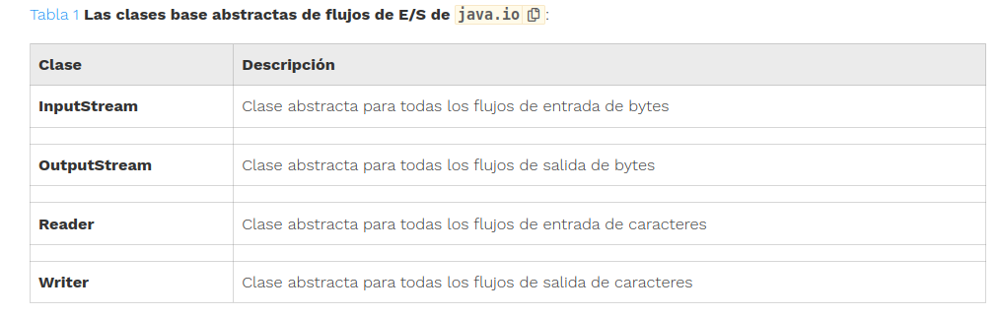
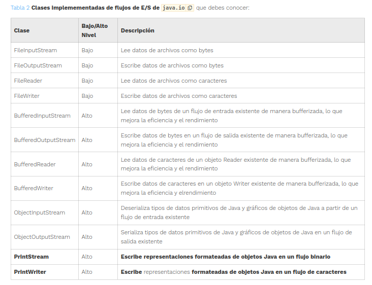

# TEMA 1
## Apuntes rápidos Acceso a Datos


## Clase File

La clase File se usa para leer información sobre archivos y directorios existentes, listar el contenido de un directorio o crear/eliminar archivos y directorios

#### Creación de un objeto File
Un objeto File a menudo se inicializa con una cadena que contiene una ruta absoluta o relativa al archivo o directorio en el sistema de archivos.

- **Ruta absoluta** --> Ruta completa desde el directorio raíz hasta el archivo o directorio
- **Ruta relativa** --> Ruta desde el directorio de trabajo actual hasta el archivo o directorio

#### Constructores de la clase File

```
File(String pathname)
```
Crea un objeto File a partir de una ruta en forma de cadena.

```
File(File parent, String child)
```
Crea un objeto File a partir de una ruta principal y una secundaria.


```
File(String parent, String child)
```

Crea un objeto File a partir de una ruta principal y una secundaria.

```
File(URI uri)
```

Crea un objeto File a partir de un URI.

### Métodos más importantes de java.io.File

- **boolean delete()** --> Borra el archivo o directorio y devuelve true sólo si la operación se completó con éxito. Si esta instancia es un directorio, el directorio debe estar vacío para poder eliminarse.

L
- **boolean exists()** -->	Comprueba si un archivo existe


- **String getAbsolutePath()** -->	Obtiene el nombre absoluto del archivo o directorio en el sistema de archivos


- **String getName()** -->	Obtiene el nombre del archivo o directorio


- **String getParent()** --> Obtiene el directorio principal en el que se encuentra la ruta, o null si no hay ninguno


- **boolean isDirectory()** --> Comprueba si una referencia File es un directorio en el sistema de archivos


- **boolean isFile()** -->	Comprueba si una referencia File es un archivo en el sistema de archivos


- **long lastModified()** -->	Devuelve el número de milisegundos desde la época (número de milisegundos desde las 12 a.m. UTC del 1 de enero de 1970) en que se modificó el archivo por última vez


- **long length()** -->	Obtiene el número de bytes en el archivo


- **File[] listFiles()** -->	Obtiene una lista de archivos dentro de un directorio


- **boolean mkdir()** -->	Crea el directorio especificado en la ruta


- **boolean mkdirs()** -->	Crea el directorio especificado en la ruta, incluyendo cualquier directorio principal inexistente


- **boolean renameTo(File dest)** -->	Cambia el nombre del archivo o directorio denotado por esta ruta a dest y devuelve true sólo si la operación tuvo éxito.


### Conversión entre `java.io.File` y `java.nio.file.Path`

La clase java.io.File proporciona el método toPath, que convierte una instancia de estilo antiguo en una instancia java.nio.file.Path:

```java 
Path entrada = file.toPath();
```

De esta forma puedes aprovechar el conjunto de características que ofrece la clase `Path`


### La clase `java.io.RandomAccessFile`

La clase RandomAccessFile permite acceso no secuencial, o aleatorio, al contenido del archivo.

Permite leer y escribir (implementa las interfaces DataInput y DataOutput) en archivos de acceso aleatorio. En el constructor se especifica el modo de apertura, lectura o escritura:

```java
new RandomAccessFile("prueba.txt", "r");  // Solo lectura
new RandomAccessFile("proba.txt", "rw");  // Lectura y escritura
new RandomAccessFile("proba.txt", "rwd"); // Lectura y escritura, sincronizado
```

Con esto podemo leer y escribir en archivo. Por ejemplo si queremos escribir en un archivo y luego leerlo, haríamos lo siguiente:
```java
File archivo = new File("prueba.txt");

        if (archivo.exists()){ //Comprobamos qu eel archivo existe y si no crea un nuevo
            RandomAccessFile randomAccessFile= new RandomAccessFile("prueba.txt", "rw");
            randomAccessFile.writeUTF("Hola que tal como estás"); //EScribimos un string
            randomAccessFile.seek(0); // Posicion 0
            System.out.println(randomAccessFile.readUTF()); // Leemos un String
            randomAccessFile.close();
        }else {
            archivo.createNewFile();
        }
```

### Modos de acceso de la clase `RandomAccessFile`

- **r** --> Modo de lectura. Llamar a los métodos de escritura lanzará en una IOException.


- **rw** --> Modo de lectura y escritura.


- **rwd** --> Modo de lectura y escritura - sincrónicamente. Todas las actualizaciones al contenido del archivo se escriben en el disco de manera sincrónica.


- **rws** --> Modo de lectura y escritura - sincrónicamente. Todas las actualizaciones al contenido del archivo o metadatos se escriben en el disco de manera sincrónica.


### Posicion del puntero

COmo ya sabemos con `seek(posicion)` situamos el pultero en el archivo.

Si lo que queremos es tener la posición actual del puntero para eso usmamos el método `getFilePointer()`

### Cerrar el archivo

Recordar que el método `close()` tiene que ser llamado cuando se termine de usar la estancia  de `RandomAccessFile`


****

## Flujos de E/S

La API `java.io` define dos conjuntos de clases de flujos para la lectura y escritura de flujos: flujos de bytes y flujos de caracteres.

### Flujos de bytes


**Los flujos de bytes leen/escriben datos binarios (0 y 1)** y tienen nombres de clase que terminan en `InputStream` o `OutputStream`.
    

Todas las clases **descienden (heredan)** de `InputStream` y `OutputStream`.
    

Hay muchas clases de flujos de bytes, como: `FileInputStream` y `FileOutputStream`. Todos los restantes flujos funcionan del mismo modo sólo difieren en la forma de construirlos.


Los programas utilizan flujos de bytes para realizar la entrada y salida de bytes de 8 bits. Todas las clases de flujos de bytes heredan de InputStream y OutputStream.

### Flujos de caracteres


Los flujos de caracteres **leen/escriben datos de texto** y tienen nombres de clase que terminan en `Reader` o `Writer`.
    

Automáticamente, **transforma caracteres Unicode (formato de Java) al conjunto de caracteres local**.
    

Todas las clases **descienden de `Reader` y `Writer`**.
    

Hay muchas clases de flujos de carácter, como :`FileReader` (usa internamente FileInputStream), `FileWriter` (usa internamente FileOutpuStream). Todos los restantes flujos funcionan de igual modo, sólo difieren en la forma de construirlos.

****

## Flujos de bytes

`FileInputStream` y `FileOutputStream`

### Cierre de flujos

Cerrar un flujo es muy importante. Para ello la técica más recomendada es utilizar **try-with-rsoureces**
```java
try (FileInputStream in = new FileInputStream("otto.txt");
     FileOutputStream out = new FileOutputStream("nohaycole.txt")) {
    int c;
    while ((c = in.read()) != -1) {
        out.write(c);
    }
}
```
### ObjectInputStream y ObjectOutputStream

`ObjectInputStream`: lee objetos Java serializados del flujo de entrada y los deserializa. 

`ObjectOutputStream`: escribe objetos Java serializados en un flujo de salida.

Para emplear las clases `ObjectInputStream`, `ObjectOutputStream` los objetos a leer (escribir deben implantar la interface: **Serializable** (dicha interface no tiene métodos para implantar)


#### ¿Que es la serialización y deserialización?

La serialización es el proceso de convertir un objeto en una secuencia de bytes que se pueden escribir en un flujo de salida y, posteriormente, reconstruir el objeto a partir de esos bytes. La deserialización es el proceso inverso: reconstruir un objeto a partir de una secuencia de bytes.

### Lectura desde URL

Se puede emplear la clase `URL` y `openStream()`:

```java
import java.io.*;

public class LeerURL {
    public static void main(String[] args) throws Exception {
        // URL url = new URL("https://manuais.pages.iessanclemente.net/plantillas/dam/ad/"); // Desaprobado.
        // Versión actualizada:
        URI uri = new URI("https://manuais.pages.iessanclemente.net/plantillas/dam/ad/");
        URL url = uri.toURL();
        
        try (InputStream is = url.openStream();
             InputStreamReader isr = new InputStreamReader(is); // es un puente de bytes a caracteres.
             int c;
             while ((c = isr.read()) != -1) {
                 System.out.print((char) c);
             }
        }
//        // Código equivalente con buffer:
//        try (InputStream is = url.openStream();
//             InputStreamReader isr = new InputStreamReader(is);
//             BufferedReader br = new BufferedReader(isr)) { // Lo veremos en el siguiente apartado.
//            String line;
//            while ((line = br.readLine()) != null) {
//                System.out.println(line);
//            }
//        }
    }
}
```


**Para crear una URL se recomienda emplear URI**

```java
    URI uri = new URI("https://manuais.pages.iessanclemente.net/plantillas/dam/ad/");
    URL url = uri.toURL();

    url.openStream(); // Abreviatura de:
    url.openConnection().getInputStream(); // openConnection() devuelve un objeto de tipo URLConnection.
```


El método `openConnection()` de URL devuelve un objeto de tipo `URLConnection`:

```java
URI uri = new URI("https://manuais.pages.iessanclemente.net/plantillas/dam/ad/");
URL url = uri.toURL();
URLConnection urlConnection = url.openConnection();
urlConnection.getInputStream();
```

#### HttpURLConnection
Permite añadir elementos específicos de HTTP, como el tamaño del contenido, o el tipo de archivo:

```java
URL url = new URI("https://manuais.pages.iessanclemente.net/plantillas/dam/ad/").toURL();
HttpURLConnection httpConnection = (HttpURLConnection) url.openConnection();  // Hereda de URLConnection
httpConnection.getInputStream();
httpConnection.setRequestMethod("HEAD");
long tamanho = httpConnection.getContentLengthLong();
```

****

## Flujos de Caracteres


Los flujos de caracteres leen/escriben datos de texto y tienen nombres de clase que terminan en Reader o Writer.

Automáticamente, transforma caracteres Unicode (formato de Java) al conjunto de caracteres local.

Todas las clases descienden de Reader y Writer.

Hay muchas clases de flujos de carácter, como: FileReader (usa internamente FileInputStream), FileWriter (usa internamente FileOutpuStream). Todos los restantes flujos funcionan de igual modo, sólo difieren en la forma de construirlos.


### Reader y Writer

`FileReader` y `FileWriter`

Con try-with-resources, el código es más limpio y más fácil de leer. `FileReader` y `FileWriter` se cierran automáticamente cuando el bloque try-with-resources se completa
```java
try (
        FileReader inputStream = new FileReader("otto.txt");
        FileWriter outputStream = new FileWriter("nohaycole.txt");
    ) {
        int c;
        while ((c = inputStream.read()) != -1) {
            outputStream.write(c);
        }
    }
```

`FileReader`, por ejemplo, utiliza `FileInputStream`, mientras que `FileWriter` utiliza `FileOutputStream`.

Son flujos de caracteres que leen y escriben bytes, respectivamente, son flujos de “puente” byte-a-carácter de propósito general: `InputStreamReader` y `OutputStreamWriter`.

****

## Flujos de E/S con Buffer

### Flujos de bajo y alto nivel

Los flujos de alto nivel pueden tomar otros flujos de alto nivel como entrada. Por ejemplo, aunque el siguiente código pueda parecer un poco extraño al principio, el estilo de encapsular un flujo es bastante común en la práctica:
```java
try (var ois = new ObjectInputStream(new BufferedInputStream(
new FileInputStream("noHayCole.txt")))) {
System.out.print(ois.readObject());
}

```

En este ejemplo, `FileInputStream` es el flujo de bajo nivel que interactúa directamente con el archivo, la cual está envuelta por `BufferedInputStream` de alto nivel para mejorar el rendimiento. Finalmente, el objeto completo está envuelto por `ObjectInputStream`, de alto nivel, que nos permite interpretar los datos como un objeto Java.

Las únicas clases de flujos de bajo nivel con las que debes estar familiarizado son las que operan en archivos. **El resto de las clases de flujos no abstractas son todas flujos de alto nivel.**

### Clases base para flujos: `InputStream`, `OutputStream`, `Reader` y `Writer`

- Una clase con las palabras "InputStream" u “OutputStream” en su nombre se utiliza para leer o escribir datos binarios (o de bytes), respectivamente

- Una clase con las palabras "Reader" o “Writer” en su nombre se utiliza para leer o escribir datos de caracteres (o cadenas), respectivamente.

- La mayoría, pero no todas, las clases de entrada tienen una clase de salida correspondiente (`FileInputStream` y `FileOutputStream`, por ejemplo)

- Un flujo de bajo nivel se conecta directamente a la fuente de datos

- Un flujo de buffer se construye sobre otro flujo de bajo mediante encapsulación (dentro de un buffer):
```java
BufferedReader in = new BufferedReader(new FileReader("chocolateCaramelo.mp3"));
```

### Tabla resumen de clases de flujos de E/S







****


## Operaciones comunes con flujos de E/S

| Flujo                    | Nombre del Método                         | Descripción                                                                                  |
|--------------------------|-------------------------------------------|----------------------------------------------------------------------------------------------|
| Todos los flujos         | `void close()`                            | Cierra el flujo y libera los recursos                                                       |
| Todos los flujos de entrada | `int read()`                           | Lee un solo byte o devuelve -1 si no hay bytes disponibles                                  |
| InputStream              | `int read(byte[] b)`                      | Lee valores en un búfer. Devuelve el número de bytes leídos                                 |
| Reader                   | `int read(char[] c)`                      | Lee valores en un búfer. Devuelve el número de bytes leídos                                 |
| InputStream              | `int read(byte[] b, int offset, int length)` | Lee hasta `length` valores en un búfer, comenzando desde la posición `offset`. Devuelve el número de bytes leídos |
| Reader                   | `int read(char[] c, int offset, int length)` | Lee hasta `length` valores en un búfer, comenzando desde la posición `offset`. Devuelve el número de bytes leídos |
| Todos los flujos de salida | `void write(int)`                       | Escribe un solo byte                                                                        |
| OutputStream             | `void write(byte[] b)`                    | Escribe un array de valores en el flujo                                                     |
| Writer                   | `void write(char[] c)`                    | Escribe un array de valores en el flujo                                                     |
| OutputStream             | `void write(byte[] c, int offset, int length)` | Escribe `length` valores del array en un flujo, empezando desde el índice `offset`         |
| Writer                   | `void write(char[] c, int offset, int length)` | Escribe `length` valores del array en un flujo, empezando desde el índice `offset`         |
| Todos los flujos de entrada | `boolean markSupported()`              | Devuelve `true` si la clase de flujo admite `mark()`                                        |
| Todos los flujos de entrada | `void mark(int readLimit)`             | Marca la posición actual en el flujo                                                        |
| Todos los flujos de entrada | `void reset()`                         | Intenta restablecer el flujo a la posición marcada                                          |
| Todos los flujos de entrada | `long skip(long n)`                    | Lee y descarta un número especificado de caracteres                                         |
| Todos los flujos de salida | `void flush()`                          | Vacía los datos acumulados a través del flujo                                               |


